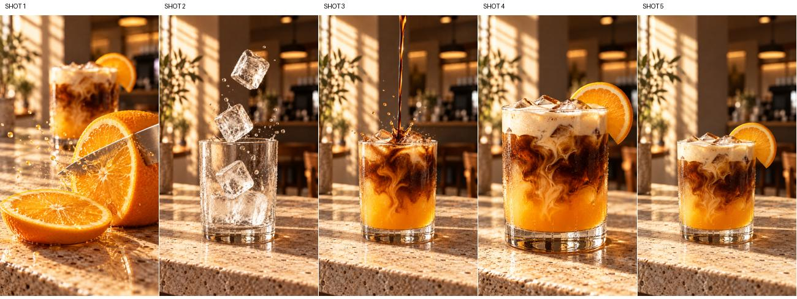

https://github.com/user-attachments/assets/8f1c9586-64b5-4aa9-9d5e-2a27af134941

# Orange Cloud Coffee

A fictional 15-second vertical product advertisement for an iced espresso, fresh orange, ice, and creamy foam drink.



**[Watch the final advertisement](Orange_Cloud_Coffee_15s.mp4)** · [Read the storyboard](STORYBOARD.md)

## Creative concept

**The morning, with a twist.** Cut orange, falling ice, a dramatic espresso pour, cloudlike cream, and a sunlit hero product shot. The final line is **“Coffee. Citrus. Unexpected.”** The audience is café and short-form food viewers interested in a refreshing, distinctive coffee drink.

The five shots use one straight-sided glass, thick base, travertine counter, warm café light, and matching orange, espresso, and cream palette. The visual assets are original AI-generated product photographs; motion consists of gentle digital camera moves and dissolves. The pour and ice action are photographic instants rather than continuous generated video. Typography and synthesized audio are produced in code. No commercial music or third-party audio samples are used.

## Files

| Path | Purpose |
| --- | --- |
| `Orange_Cloud_Coffee_15s.mp4` | Final vertical 720 × 1280, 24 fps, 15.00-second H.264/AAC video |
| `STORYBOARD.md` | Five-shot timing and sound plan |
| `STORYBOARD_CONTACT_SHEET.jpg` | Visual overview |
| `assets/shot_01.png` … `shot_05.png` | Original visual assets |
| `assets/type_01.png` … `type_04.png` | Generated chapter typography overlays |
| `assets/final_typography.png` | Final title graphic |
| `assets/sound_design.wav` | Original synthesized sound design |
| `build_ad.py` | Video assembly and sound generation |

## Rebuild

Install [FFmpeg](https://ffmpeg.org/) and Python 3, then run:

```bash
python -m pip install -r requirements.txt
python build_ad.py
```

FFmpeg must be on your `PATH`. The script selects Georgia/Arial or DejaVu fonts where available, so rebuilding on another platform may slightly alter the typography. The packaged MP4 is the approved visual master.

This is a portfolio concept for a fictional product, not an existing café brand.
